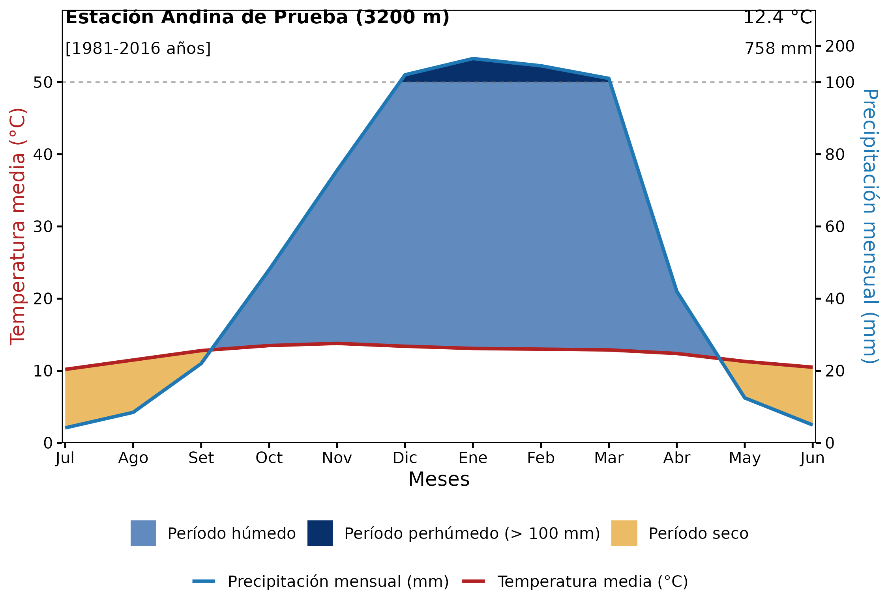
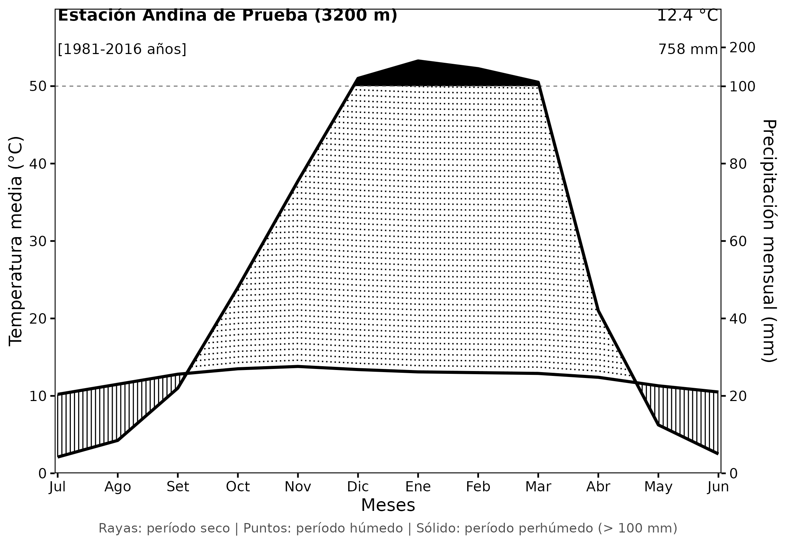
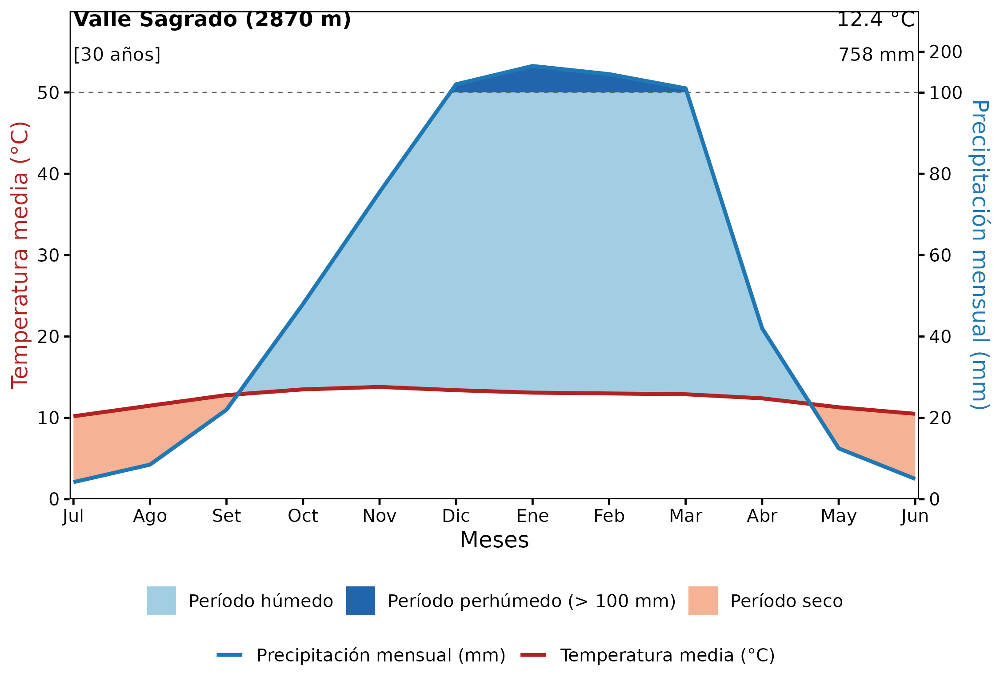

# Climatodiagramas de Walter-Lieth por Punto y por Área con rpisco

El **climatodiagrama de Walter-Lieth** (Walter y Lieth, 1960) es una
herramienta estándar en ecología, climatología, agronomía e hidrología
para evaluar el régimen bioclimático y el balance hídrico mensual de una
localidad o territorio.

El paquete `rpisco` incorpora la función
[`climatodiagrama()`](https://PaulESantos.github.io/rpisco/reference/climatodiagrama.md),
la cual genera gráficos bioclimáticos basados en `ggplot2` y listos para
publicación o personalización.

En esta guía se describen tres flujos de trabajo prácticos: 1. **Flujo
A:** Creación del climatodiagrama a partir de **datos tabulares propios
del usuario** (CSV o data frame). 2. **Flujo B:** Recuperación y cálculo
de datos de precipitación y temperatura **por punto** (coordenadas o
estaciones meteorológicas) utilizando las grillas de PISCO. 3. **Flujo
C:** Recuperación y cálculo de datos **por área territorial**
(distritos, provincias o cuencas hidrográficas) mediante extracción
zonal media.

------------------------------------------------------------------------

## Fundamentos del Diagrama de Walter-Lieth

1.  **Escala Ombrotérmica:** La temperatura media mensual ($`T`$, en °C)
    y la precipitación mensual ($`P`$, en mm) se trazan sobre un mismo
    eje vertical con una relación de $`1\ ^\circ\text{C} = 2\text{ mm}`$
    (criterio de Gaussen).
2.  **Período Seco ($`P < 2T`$):** Cuando la curva de precipitación se
    ubica por debajo de la curva de temperatura, la precipitación no
    cubre la evapotranspiración potencial de referencia, indicando
    condiciones de aridez o estrés hídrico.
3.  **Período Húmedo ($`P \ge 2T`$):** Cuando la curva de precipitación
    sobrepasa a la de temperatura, existe disponibilidad hídrica
    favorable.
4.  **Período Perhúmedo ($`P > 100\text{ mm}`$):** Para evitar que
    precipitaciones torrenciales distorsionen la escala del diagrama,
    los valores que superan los $`100\text{ mm}`$ se comprimen 10 veces
    ($`1\ ^\circ\text{C} = 20\text{ mm}`$), destacando este exceso con
    un sombreado sólido característico.
5.  **Disposición Temporal:** En el hemisferio sur, la representación
    tradicional ordena los meses de **julio a junio**, manteniendo el
    período estival y de mayores precipitaciones en el centro del
    gráfico.

------------------------------------------------------------------------

## Paquetes Requeridos

``` r

library(rpisco)
library(ggplot2)
library(sf)
library(terra)
```

------------------------------------------------------------------------

## Flujo A: Diagrama con Datos Proporcionados por el Usuario

Si ya dispone de registros mensuales de precipitación y temperatura (de
una estación del SENAMHI, una tesis o un archivo CSV), puede utilizarlos
directamente estructurando un `data.frame` o `tibble` de **12 filas**
con las columnas del mes, la temperatura media (°C) y la precipitación
total (mm).

`rpisco` incluye el conjunto de datos de prueba `clima_ejemplo`:

``` r

# Cargar el conjunto de datos de ejemplo
data(clima_ejemplo)
print(clima_ejemplo)
#>    MES TMED  PTOT
#> 1  Jul 10.2   4.2
#> 2  Ago 11.5   8.5
#> 3  Set 12.8  22.0
#> 4  Oct 13.5  48.0
#> 5  Nov 13.8  75.5
#> 6  Dic 13.4 120.0
#> 7  Ene 13.1 165.0
#> 8  Feb 13.0 145.0
#> 9  Mar 12.9 110.0
#> 10 Abr 12.4  42.0
#> 11 May 11.3  12.5
#> 12 Jun 10.5   5.0
```

### 1. Estilo a Color (`estilo = "color"`)

El estilo por defecto resalta visualmente las tres zonas bioclimáticas
(dorado para el período seco, celeste para el húmedo y azul marino para
el perhúmedo):

``` r

p_color <- climatodiagrama(
  datos = clima_ejemplo,
  estacion = "Estación Andina de Prueba",
  elevacion = 3200,
  anios = "1981-2016",
  estilo = "color"
)
p_color
```



### 2. Estilo Clásico de Publicación (`estilo = "trama"`)

Para publicaciones científicas en blanco y negro, `estilo = "trama"`
dibuja rayas verticales continuas para el período seco, líneas punteadas
para el húmedo y relleno negro sólido para el perhúmedo:

``` r

p_trama <- climatodiagrama(
  datos = clima_ejemplo,
  estacion = "Estación Andina de Prueba",
  elevacion = 3200,
  anios = "1981-2016",
  estilo = "trama"
)
p_trama
```



### 3. Personalización con `ggplot2` y Exportación

Dado que
[`climatodiagrama()`](https://PaulESantos.github.io/rpisco/reference/climatodiagrama.md)
devuelve un objeto `ggplot`, se puede enriquecer con temas, tipografías
y guardarse mediante
[`ggplot2::ggsave()`](https://ggplot2.tidyverse.org/reference/ggsave.html):

``` r

# Personalizar tipografía y paleta
p_custom <- climatodiagrama(
  datos = clima_ejemplo,
  estacion = "Valle Sagrado",
  elevacion = 2870,
  anios = "30",
  estilo = "color",
  color_seco = "#F4A582",
  color_humedo = "#92C5DE",
  color_perhumedo = "#2166AC"
) +
  theme(plot.title = element_text(face = "bold"))

p_custom
```



Para guardar en alta resolución:

``` r

ggplot2::ggsave(
  filename = "climatodiagrama_valle_sagrado.png",
  plot = p_custom,
  width = 7.5,
  height = 5.2,
  dpi = 300
)
```

------------------------------------------------------------------------

## Flujo B: Recuperación de Datos por Punto con `rpisco`

En muchas localidades andinas o amazónicas no se cuenta con estaciones
meteorológicas físicas continuas. Con `rpisco` es posible extraer las
climatologías mensuales directamente de los productos grillados
oficiales: \* **Precipitación:** `PISCOp_clim2.nc` (normal mensual
1981–2010 de 12 capas). \* **Temperatura Máxima:**
`tmax_mean_1981-2010_01_12.nc` (normal mensual 1981–2010 de 12 capas).
\* **Temperatura Mínima:** `tmin_mean_1981-2010_01_12.nc` (normal
mensual 1981–2010 de 12 capas).

La temperatura media mensual se estima como
$`TMED = \frac{TMAX + TMIN}{2}`$.

### Paso a paso: Extracción para una coordenada geográfica

Consideremos la ciudad de **Cusco** (latitud: $`-13.53^\circ`$,
longitud: $`-71.96^\circ`$, elevación: $`3399\text{ m}`$):

``` r

# 1. Autorizar la descarga de las normales climatológicas en la caché
pisco_download("climatology")
pisco_download("tmax_clim")
pisco_download("tmin_clim")

# 2. Cargar los SpatRasters de 12 capas mensuales
r_prec <- pisco_read("climatology")
r_tmax <- pisco_read("tmax_clim")
r_tmin <- pisco_read("tmin_clim")

# 3. Definir el punto de interés
punto_cusco <- data.frame(lon = -71.96, lat = -13.53)

# 4. Extraer los valores de las 12 capas para el punto
prec_vals <- as.numeric(terra::extract(r_prec, punto_cusco)[1, -1])
tmax_vals <- as.numeric(terra::extract(r_tmax, punto_cusco)[1, -1])
tmin_vals <- as.numeric(terra::extract(r_tmin, punto_cusco)[1, -1])

# 5. Calcular temperatura media mensual
tmed_vals <- (tmax_vals + tmin_vals) / 2

# 6. Organizar en orden hemisferio sur (Julio a Junio)
orden_sur <- c(7:12, 1:6)
meses_sur <- c("Jul", "Ago", "Set", "Oct", "Nov", "Dic",
               "Ene", "Feb", "Mar", "Abr", "May", "Jun")

datos_punto <- data.frame(
  MES  = factor(meses_sur, levels = meses_sur),
  TMED = round(tmed_vals[orden_sur], 1),
  PTOT = round(prec_vals[orden_sur], 1)
)

# 7. Graficar el climatodiagrama de la estación/punto
climatodiagrama(
  datos = datos_punto,
  estacion = "Cusco (PISCO Gridded)",
  elevacion = 3399,
  anios = "1981-2010",
  estilo = "color"
)
```

------------------------------------------------------------------------

## Flujo C: Recuperación de Datos por Área con `rpisco`

Cuando se analiza una cuenca hidrográfica, una reserva natural o una
provincia completa, el régimen bioclimático se caracteriza a partir de
la **media zonal** espacial sobre el polígono territorial.

### Paso a paso: Extracción para un polígono territorial

A continuación se muestra cómo procesar un polígono (por ejemplo, la
provincia de **Anta**, Cusco obtenida con `geoperu`):

``` r

library(geoperu)

# 1. Obtener la geometría de la provincia
anta_provincia <- geoperu::get_geo_peru("ANTA", level = "prov", simplified = TRUE)

# 2. Extraer el promedio espacial mensual sobre toda la provincia
prec_area <- pisco_extract(r_prec, polygons = anta_provincia, id_col = "provincia", fun = mean)
tmax_area <- pisco_extract(r_tmax, polygons = anta_provincia, id_col = "provincia", fun = mean)
tmin_area <- pisco_extract(r_tmin, polygons = anta_provincia, id_col = "provincia", fun = mean)

# 3. Calcular la temperatura media zonal
tmed_area_vals <- (tmax_area$precipitation + tmin_area$precipitation) / 2
prec_area_vals <- prec_area$precipitation

# 4. Estructurar el data frame mensual (julio a junio)
datos_area <- data.frame(
  MES  = factor(meses_sur, levels = meses_sur),
  TMED = round(tmed_area_vals[orden_sur], 1),
  PTOT = round(prec_area_vals[orden_sur], 1)
)

# 5. Generar el climatodiagrama territorial
climatodiagrama(
  datos = datos_area,
  estacion = "Provincia de Anta (Promedio Zonal)",
  elevacion = 3450,
  anios = "1981-2010",
  estilo = "color"
)
```

------------------------------------------------------------------------

## Conclusiones

- [`climatodiagrama()`](https://PaulESantos.github.io/rpisco/reference/climatodiagrama.md)
  automatiza el cálculo de las transiciones ombrotérmicas conforme a la
  metodología canónica de Walter y Lieth (1960).
- Permite utilizar tanto registros de estaciones físicas ingresados por
  el usuario como series espaciotemporales extraídas de la base de datos
  climática PISCO mediante
  [`pisco_read()`](https://PaulESantos.github.io/rpisco/reference/pisco_read.md)
  y
  [`pisco_extract()`](https://PaulESantos.github.io/rpisco/reference/pisco_extract.md).
- Ofrece versatilidad tanto para visualizaciones a color interactivas
  como para figuras monocromáticas de publicaciones académicas.
